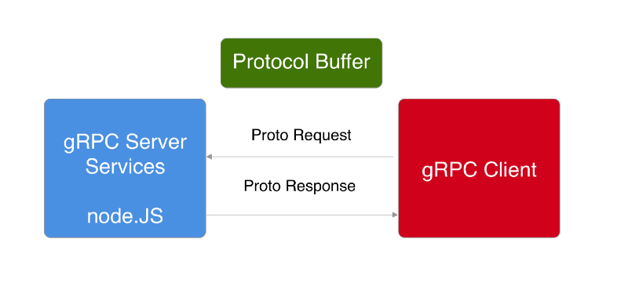
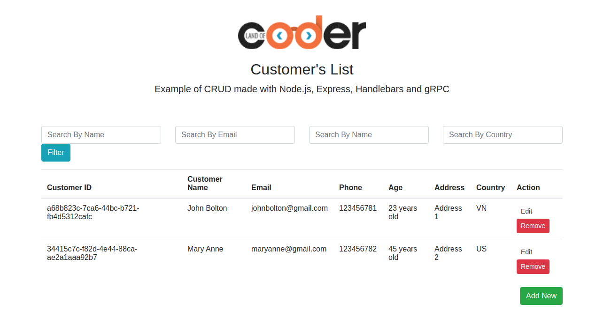

# a CRUD with gRPC and Node, Express for example manage customer info

## gRPC
gRPC is a modern, open source, high performance RPC framework that can run in any environment. It can efficiently connect services in and across data centers with pluggable support for load balancing, tracing, health checking and authentication.

Like many RPC systems, gRPC is based on the concept of defining a service in terms of functions (methods) that can be called remotely. For each method, you define the parameters and return types. Services, parameters, and return types are defined in .proto files using Google's open source language-neutral protocol buffers mechanism.

With the gRPC transporter, Nest uses .proto files to dynamically bind clients and servers to make it easy to implement remote procedure calls, automatically serializing and deserializing structured data.

"gRPC is a language-neutral, platform-neutral remote procedure call (RPC) framework and toolset developed at Google. It lets you define a service using Protocol Buffers, a particularly powerful binary serialization toolset and language. It then lets you generate idiomatic client and server stubs from your service definition in a variety of languages" - Google

## Setup

This project is separated in two parts:
- Server: where gRPC serves the remote calls defined in the proto file
- Client: Express/Node/Bootstrap web page to CRUD the server operations.

In order to run this app, issue in separate command line windows:
- Inside the /client folder: `node index`
- Inside the /root folder: `npm start`

Then, go to http://localhost:3000/ and test it out.

## Demo Preview

